[TOC]

# 0. 安装
**注：** 下列安装教程是在Linux环境，主从服务器的登陆账户均为e0024， 所有文件都在/data/e0024/workspace/spark目录下进行，若是Windows系统，export命令等价于添加环境变量
## 0. 安装jdk8
下载[jdk8](http://www.oracle.com/technetwork/java/javase/downloads/jdk8-downloads-2133151.html) 并解压到 **/data/e0024/workspace/spark/jdk1.8.0_171**，并在/home/e0024/.bashrc末尾中写入下列语句
``` txt
export JAVA_HOME=/data/e0024/workspace/spark/jdk1.8.0_171
export JRE_HOME=${JAVA_HOME}/jre
export CLASSPATH=.:${JAVA_HOME}/lib:${JRE_HOME}/lib
export PATH=${JAVA_HOME}/bin:${JRE_HOME}/bin:$PATH 
```
然后通过执行
``` bash
source /home/e0024/.bashrc
```
刷新环境变量，执行
``` bash
which java
```
可以验证是否安装成功
## 1. 安装Scala
- 对该语言不熟悉，因此没有安装，若需要用该语言，可按下步骤
下载[Scala](https://www.scala-lang.org/download/)并解压为 **/data/e0024/workspace/spark/scala**，在/home/e0024/.bashrc末尾中写入下列语句
``` txt
export SCALA_HOME=/data/e0024/workspace/spark/scala
export PATH=${SCALA_HOME}/bin:$PATH
```
刷新环境变量并通过
``` bash
which scala
```
验证是否安装成功
## 2. 安装spark
选择进spark的[官网](http://spark.apache.org/downloads.html)下载已经编译好的文件
，解压到
**/data/e0024/workspace/spark/pyspark-2.7.3**进入该目录执行
``` bash
export SPARK_HOME=/data/e0024/workspace/spark/pyspark-2.7.3
export PATH=$(SPARK_HOME)/bin:${SPARK_HOME}/sbin:$PATH
pip install .   # 安装pyspark
```
将安装后的pypark安装到spark目录（如果是Aanconda那么目录为：）
``` bash
 cp -r ${HOME}/anaconda3/lib/python3.6/site-packages/pyspark/python ${SPARK_HOME}/python
pyspark # 执行pyspark查看安装结果
```
若出现
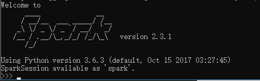
即成功安装
## 3. 安装hadoop
下载[hadoop](http://hadoop.apache.org/releases.html)，并解压为 **/data/e0024/workspace/spark/hadoop-2.7.6**， 在/home/e0024/.bashrc末尾中写入下列语句
``` txt
export HADOOP_HOME=/data/e0024/workspace/spark/hadoop-2.7.6
export HADOOP_CONF_DIR=${HADOOP_HOME}/etc/hadoop
export YARN_HOME=${HADOOP_HOME}
export YARN_CONF_DIR=${YARN_HOME}/etc/hadoop
export PATH=${HADOOP_HOME}/bin:${HADOOP_HOME}/sbin:$PATH
```
刷新环境变量
### 3.0 配置hostname
``` bash
sudo vim /etc/hosts
```
例如我master0主节点ip为192.168.11.5， slave0从节点ip为192.168.11.6，若有多个slave， 再换行输入**192.168.11.7 slave1**，名字可自己填，不一定要master0， slave0， slave1，即
在/etc/hosts文件 内加入如下内容
``` txt
192.168.11.5 master0
192.168.11.6 slave0
```
### 3.1 配置ssh无密登陆
``` bash
ssh-keygen -q -t rsa # 然后一路回车即可， 这个操作需要在每一个主/从节点（master0， slave0等）上操作
```
然后将所有从节点生成的id_rsa.pub汇总到到主节点的 **~/.ssh** 目录下， 注意不要重名覆盖，在master0节点服务器参考如下命令拷贝slave0中的id_rsa.pub， 同理于其他的节点
``` bash
scp e0024@slave0:/home/e0024/.ssh/id_rsa.pub /home/e0024/.ssh/id_rsa.pub.slave0
```
将所有节点的id_rsa.pub汇集于master0节点后，在master0节点服务器执行
``` bash
cd /home/e0024/.ssh
cat id_rsa.pub* >> authorized_keys
```
然后通过 **scp**命令将authorized_keys文件从master0节点服务器分发到所有节点的 **/home/e0024/.ssh**目录下， 分发结束后
在master0节点服务器执行
``` bash
ssh slave0
```
若不需要密码，直接登录则表示配置成功
### 3.2 配置hadoop与yarn
``` bash
cd ${HADOOP_HOME}/etc/hadoop  # 进入hadoop配置文件目录
```
#### 3.2.0 slaves
本教程中将master0与slave0都作为工作节点，因此执行
``` bash
echo master0 > ${HADOOP_CONF_DIR}/slaves
echo slave0 >> ${HADOOP_CONF_DIR}/slaves
echo master0 > ${SPARK_HOME}/conf/slaves
echo slave0 >> ${SPARK_HOME}/conf/slaves
```
使用vim编辑这两个slaves文件也是可以的，只要将工作节点的hostname或者ip地址写入进去就可以，每一个节点一行vim， 如下图
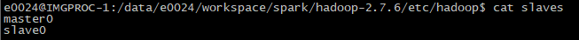
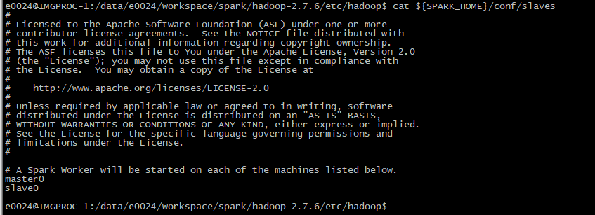
#### 3.2.1 core_site.xml
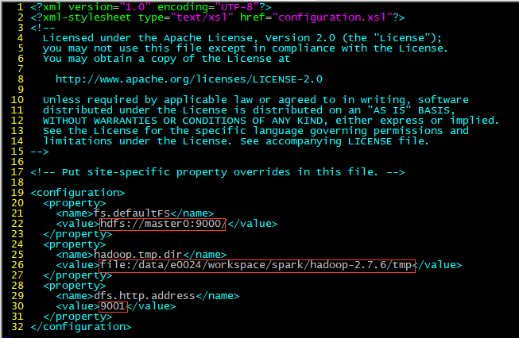
图中第一处红线为为开启的hdfs文件系统，写入对应的hdfs://host:port，端口随意填写，但是不要与别的冲突
第二处红线为本地缓存，可以是${HADOOP_HOME}/tmp
第三处红线为网页查看dfs状态的端口号，随意填写但是不要与别的端口冲突
#### 3.2.2 hdfs-site.xml
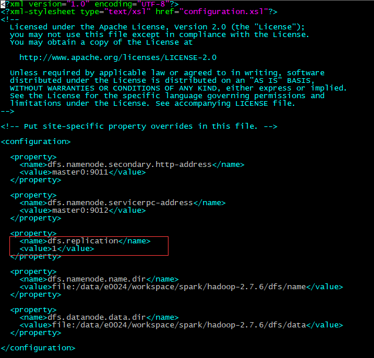
同理端口号随意设置， 其中dsf.replication 的值不要超过工作节点的个数，如教程中工作节点为master0与slave0共两个，则值设置为1不超过2
#### 3.2.3 mapred-site.xml
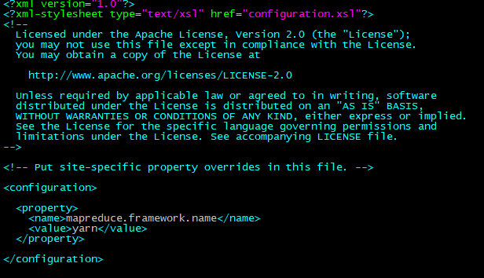
#### 3.2.4 yarn-site.xml
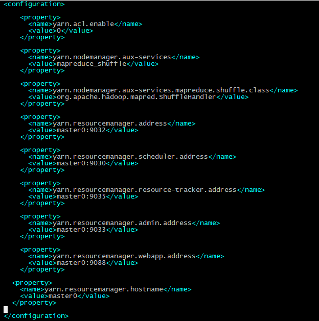
同样，端口号可随意设置， 但不要重复且不与其他服务发生冲突
#### 3.2.5 配置环境文件
0. 打开${SPARK_HOME}/conf/spark_env.sh
在文件最后一行加入下述内容，其中 **SPARK_LOCAL_IP**为每个节点服务器的ip地址
``` txt
export SPARK_LOCAL_DIRS=${SPARK_HOME}
export SPARK_MASTER_IP=192.168.11.5
export SPARK_MASTER_HOST=master0
export SPARK_MASTER_PORT=7077
export SPARK_LOCAL_IP=192.168.11.5
export PYSPARK_PYTHON=${ANACONDA_HOME}/bin/python
export SPARK_LIBARY_PATH=.:${JAVA_HOME}/lib:${JAVA_HOME}/jre/lib:${HADOOP_HOME}/lib/native
export LD_LIBRARY_PATH=${SPARK_LIBARY_PATH}:${LD_LIBRARY_PATH}
export HADOOP_CONF_DIR=${HADOOP_HOME}etc/hadoop
```
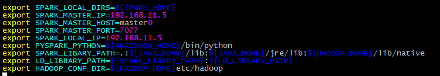

1. 打开${HADOOP_CONF_DIR}/hadoop_env.sh
``` txt
export JAVA_HOME="/data/e0024/workspace/spark/jdk1.8.0_171"
```
且在文件最后一行加入下述内容以提供日志记录
``` txt
export HADOOP_LOG_DIR="/data/e0024/workspace/spark/hadoop-2.7.6/logs"
```
2. 打开${HADOOP_CONF_DIR}/yarn_env.sh
修改的内容与方式与hadoop_env.sh一致
# 4 测试hadoop，yarn，spark
## 4.0 分发文件
教程中所有文件都是在 **/data/e0024/workspace/spark**文件夹内的，且本节操作都是在master0节点服务器上操作，利用 **scp**命令将配置好的jdk，hadoop，spark拷贝到其他服务器中相同的目录下，并且不要忘记修改每台节点服务器的${SPARK_HOME}/conf/spark_env.sh文件中的SPARK_LOCAL_IP， 即
``` bash
scp -r /data/e0024/workspace/spark e0024@slave0:data/e0024/workspace/spark
```
## 4.1 测试
### 4.1.0 测试hdfs
执行
``` bash
hadoop namenode -format # 格式化，每次修改配置文件后都要执行这语句
start-dfs.sh && jps
```
应该出现下图
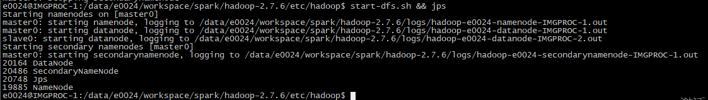
### 4.1.1 测试yarn
继续执行
``` bash
start-yarn.sh && jps
```
应该出现下图，其中Worker是因为我在slaves文件中写入了master0所以才会有，如果没有将主节点设置为工作节点Worker是不会有的
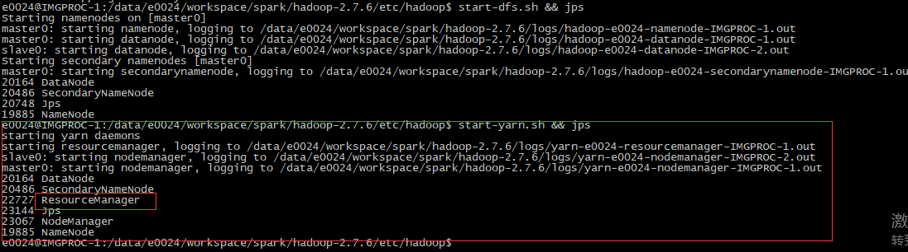
有ResourceManager出现才证明yarn开启成功，若不成功则查看
**/data/e0024/workspace/spark/hadoop-2.7.6/logs/yarn-e0024-resourcemanager-IMGPROC-1.log**日志文件，根据错误提示修改前面的配置文件， 若成功继续执行
### 4.1.2 测试spark
``` bash
start-all.sh && jps
```
应该出现
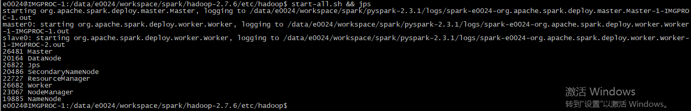

# 1. Spark简介
## 0. Spark是什么


## 1. 为什么要有这个Spark


## 2. 有了Spark能做什么/不能做什么


# 2. 快速上手
## 0. GetStarted
新建测试文件 'file.txt'， 内容为
``` tex
Hello World!!!
Hello laMia~~~
How are you???
Fine, thanks and you???
```
并在同级目录下新建文件 'main.py'，统计‘file.txt’中含有‘Hello’的语句有几行，代码如下，python代码中的logger.info, logger.debug可以改成print， 或者logging.info, logging.debug
``` python
'''
 > File: main.py
 > Date: 2018/06/11
 > Rule: get started with spark in python
'''
import os
import sys
import time
from pyspark import SparkContext
from pyspark.sql import SparkSession, SQLContext
from common.logger import logger

spark = SparkSession.builder\
        .enableHiveSupport()\
        .getOrCreate()

__LOCALPATH__ = '/home/e0024/workspace/python/spark'


def local_path(path):
  '''
  '''
  p = 'file:' + os.path.join(__LOCALPATH__, path)
  logger.debug('transform file: {} to local path: {}'.format(path, p))
  return p
  

def hdfs_path(path):
  '''
  '''
  p = os.path.join(
        'hdfs://master0:9000/user/e0024/', 
        path)
  logger.debug('transform file: {} to hdfs path: {}'.format(path, p))
  return p


def init_spark():
  '''
  '''
  try:
    spark
  except NameError as ex:
    spark = SparkSession.builder\
            .enableHiveSupport()\
            .getOrCreate()
  logger.info('Initialize spark')
  return spark
  

def close_spark():
  '''
  '''
  spark.stop()
  logger.info('Close spark')
  return
  

def keep():
  '''
  '''
  while True:
    logger.info('detect alive...')
    time.sleep(1)
  return


def go_0():
  '''
  '''
  sc = spark.sparkContext
  sc.setLogLevel('WARN')
  textFile = sc.textFile(hdfs_path('file.txt'))
  logger.info('rows: {}'.format(textFile.count())) # to get the number of rows in this DataFrame
  logger.info('first: {}'.format(textFile.first()))
  linesWithCtx = textFile.filter(lambda line: 'Hello' in line)
  logger.info('ctx:: {}'.format(linesWithCtx.count()))
  

if __name__ == '__main__':
  '''main entry
  '''
  spark = init_spark()
  go_0()
  # keep()
  close_spark()

```
在同级目录下新建调用该main.py的submit.sh脚本，代码如下，
``` bash
function logger { # function to print logs
  min_lth=40
  src_lth=${#1}
  actual_lth=${min_lth}
  blank_lth=1
  sub_lth=$(expr ${src_lth} - ${min_lth})
  TOP=""
  content="${1}"
  
  if [ ${sub_lth} -ge $(expr 2 + 2 \* ${blank_lth}) ]; \
  then \
    actual_lth=$(expr ${src_lth} + 2 + 2 \* ${blank_lth}); \
  else \
    blank_lth=$(expr ${min_lth} - ${src_lth} - 2); \
    blank_lth=$(expr ${blank_lth} / 2); \
  fi; \
  
  # splice bound line
  for((i=1;i<=${actual_lth};i++)); \
  do \
    TOP="${TOP}*"; \
  done; \
  
  # splice content
  for((i=1;i<=${blank_lth};i++)); \
  do \
    content=" ${content} "; \
  done; \
  content="*${content}*"
  
  echo "${TOP}"
  echo "${content}"
  echo "${TOP}"
}

set -e
clear
logger "START"

spark-submit \
--master yarn \
--deploy-mode client \
--class org.apache.spark.examples.SparkPi \
--name sparker_test \
main.py \
2

logger "SUCCEED"

```
清理缓存并打开hadoop, yarn, spark服务并将所需的文件file.txt上传到hdfs文件系统中
``` bash
logger "Start to acvitate spark"
rm -rf ${HADOOP_HOME}/tmp
rm -rf ${HADOOP_HOME}/dfs/data/*
rm -rf ${HADOOP_HOME}/dfs/name/*
rm -rf ${HADOOP_HOME}/logs/*
hadoop namenode -format
start-dfs.sh && start-yarn.sh && start-all.sh
logger ">> spark in ${SPARK_HOME} have been acvitated!"
hdfs dfs -mkdir -p hdfs://master0:9000/user/e0024
hdfs dfs -put file.txt hdfs://master0:9000/user/e0024/file.txt
```
将任务上传并执行，应该会出现以下结果
``` bash
chmod a+x ./submit.sh && ./submit.sh
```
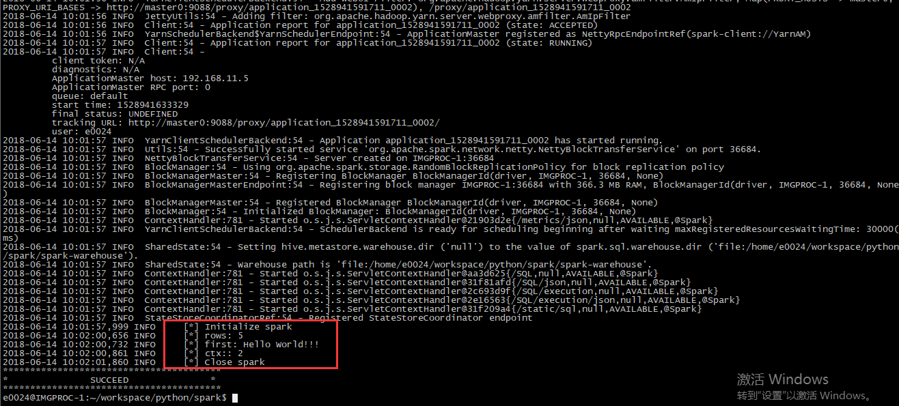

## 1. 利用spark集群跑排序算法


